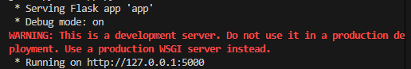

# innovate-jaar1
## How to run
Make sure you download python before you try to run the website.
Open a terminal and use "pip install flask argon2-cffi"
These are the 2 dependencies for the website.
after downloading the dependencies start the website by using the following command in a terminal:
"python app.py"
if you've installed flask and argon2-cffi it should work without errors.
once started you should get a message like the one shown in the image below.

go to the URL to use the website.